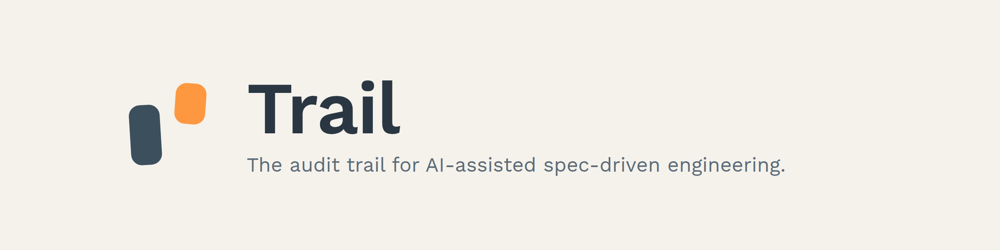
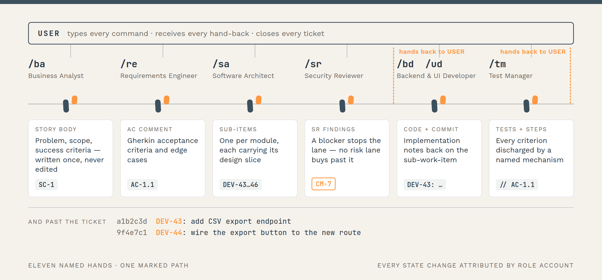
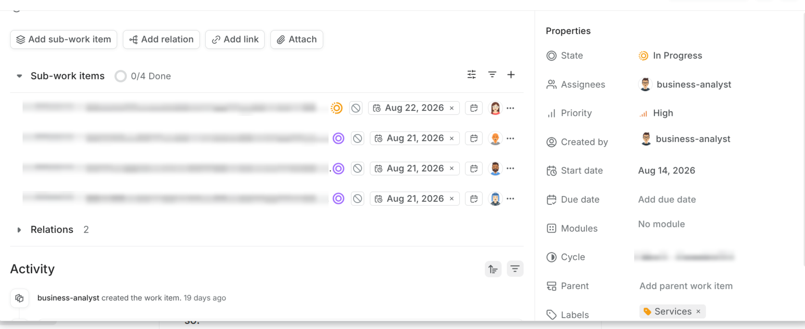

<h1 align="center">
  <picture>
    <source media="(prefers-color-scheme: dark)"
            srcset=".github/assets/trail-hero-dark.png">
    <source media="(prefers-color-scheme: light)"
            srcset=".github/assets/trail-hero-light.png">
    
  </picture>
</h1>

<p align="center">
  <strong>Engineering discipline for software you have to defend.</strong>
</p>

Eleven role-specific [Claude Code](https://claude.com/claude-code) agents take
a feature from idea to release through a [Plane](https://plane.so) workspace.
Each holds its own ticket-system account, so every requirement, review, commit
and test is attributable to a named hand — and the board becomes the audit log
you can hand to a regulator.

> **Status:** early design / beta. Installable today — see [Install](#install).

## The 60-second version

```
> /ba "Users want a CSV export of their issue list"
    Story DEV-42. Body written once: problem, scope, SC-1…SC-3, risk lane.

> /re DEV-42
    Comment on DEV-42: Gherkin criteria AC-1.1…AC-3.2, edge cases EC-1.1.a…

> /sa DEV-42
    DEV-43 backend · DEV-44 frontend · DEV-45 testing · DEV-46 docs.
    Each body carries its own design slice.

> /sr DEV-42
    Findings per child. One blocker cites CM-7 and stops the lane.
    ⇒ back to you — read them, curate them, dispatch.

> /bd DEV-43        > /ud DEV-44
    Code, plus an Implementation notes comment. Commits open with "DEV-43: ".

> /tm DEV-45        > /tw DEV-46
    Tests carrying // AC-1.1. Review steps posted on DEV-42.
    ⇒ back to you — In Review, assigned to you. You merge, you close.
```

Seven commands, seven artefacts, one chain of IDs. Nothing was triggered by the
ticket system: you typed every line.

## The bet

Most agentic coding frameworks optimise for velocity. They wire up a planner,
an architect, a coder, a reviewer, and let them produce working code faster
than a human would. That is fine — until you have to defend the code.

A regulator asks who signed off on the threat model behind an auth shortcut. A
customer asks which acceptance criterion a test actually proves. An incident
review asks what the original intent was, and whether the implementation was
true to it. In a velocity-first setup the trail goes cold fast: the agent did
it, someone approved the PR, and the *why* lives in a chat transcript that has
been compacted twice.

Trail takes the opposite bet — **discipline first, velocity second** — on the
premise that for software you eventually have to defend, the audit trail is
not an afterthought. It is the primitive.

What holds it up:

- **Description-once.** A Story body is written at creation and never edited.
  Later annotation is comment-only, so original intent stays readable.
- **Stable IDs, end to end.** Success criteria (`SC-N`), acceptance scenarios
  (`AC-N`), edge cases (`EC-N`) and non-functional requirements (`NFR-N`) are
  append-only and travel into test code as comments and into commit subjects
  as prefixes. `grep AC-1.1` walks from intent to the line that proves it.
- **Hard guardrails.** A *control manifest* holds the non-negotiables, each
  with a stable `CM-N` ID. A Story that violates one is rejected at framing
  time, not at code review.
- **Identity in the bus.** Every comment and state change is attributed by
  role-account. Scan a column and see who designed, reviewed, implemented and
  tested any change.
- **The process shrinks when the work is small.** Every Story gets a *risk
  lane*, and the lane shortens the path, not just the prose. Each trimmed
  stage leaves a `SKIP-N` receipt naming its reason — and no lane buys past a
  gate.

Where a rule can be checked mechanically, a **hook** holds it rather than a
prompt paragraph asking a persona to remember. One guard refuses a commit
whose subject drops the work-item ID; another refuses a Plane write claiming a
persona other than the one you started. How hard each holds is set in the
consumer's own `config.yaml`, and both fail open on uncertain cases — a false
deny costs more than a missed check.

## Is this for you?

| Reach for Trail when | Look elsewhere when |
|---|---|
| The code gets audited, certified, or defended later — regulated work, security-critical systems, anything with an external reviewer. | You are prototyping and the code is disposable. |
| More than one stakeholder needs to see *why* a change exists, without reading a chat log. | One person owns everything and `git log` is already enough context. |
| You want AI-written code you can still account for in six months. | You do not want to run a ticket system at all. |
| You would rather spend a turn framing a Story than a week reconstructing intent. | Throughput is the only thing being optimised. |

## What it leaves behind

Every persona turn deposits one artefact, in a place that outlives the
conversation — and the IDs carry forward past the ticket into the repository:

<p align="center">
  <picture>
    <source media="(prefers-color-scheme: dark)"
            srcset=".github/assets/trail-spine-dark.png">
    <source media="(prefers-color-scheme: light)"
            srcset=".github/assets/trail-spine-light.png">
    
  </picture>
</p>

That is not a diagram of an intention. It is what the board looks like
afterwards — sub-work-items split by module, each assigned to the role account
that owns it, every state change signed:

<p align="center">
  
</p>

The chain reads in both directions: intent → code, or code → why. A `grep` for
`AC-1.1` finds the test; the test's work-item ID finds the commit; the commit's
ticket carries the criterion that justified it.

## The team

| | Agent | Trait | Role |
|---|---|---|---|
|        | **General Manager**       | Process before pace | Founder operations — authorities, notary, legal, tax, staffing, funding, compliance. Runs on its own `HQ` project. |
|       | **Business Analyst**      | Curious about the unsaid | Turns ideas into Stories; owns backlog, priorities, and the roadmap. |
|  | **Requirements Engineer** | Pedantic about wording | Adds testable Gherkin criteria and edge cases as a comment on the Story. |
|     | **Software Architect**    | Long-horizon | Designs the solution and splits it into sub-work-items, one per module. |
|      | **Security Reviewer**     | Adversarial by default | Strict, non-negotiable gate — over the design, and again over the landed diff. |
|      | **Backend Developer**     | Sceptical of the happy path | Implements server-side changes. |
|           | **UI Developer**          | State-empathic | Implements frontend changes; also runs the pre-ticket design lane. |
|           | **Test Manager**          | Fastidious about coverage | Owns test strategy, and drives the review steps against the running app. |
|       | **Technical Writer**      | Reads own draft as a stranger | Keeps docs, READMEs and changelogs honest. |
|        | **Release Manager**       | Rollback-first | Drives versioning, tagging and release. |
|      | **Marketing Manager**     | Audience's language first | Owns the website, brand voice and SEO. Runs on its own `MKT` project. |

Typing `/<persona>` puts the main loop into that role until you say `done` or
start a different one. What each reads, writes and when to invoke it:
[`doc/PERSONAS.md`](doc/PERSONAS.md). The handover sequence over a Story's
lifetime: [`doc/WORKFLOW.md`](doc/WORKFLOW.md).

## Install

Open this repo in Claude Code and let the **`install-helper`** agent drive:

```bash
cd /path/to/trail-aiac
claude
> /trail-install-helper /path/to/my-project
```

It works out which of the three scenarios applies (greenfield with Ansible,
existing Plane without agents, existing Plane with agents), installs what
prerequisites it can, asks for the few inputs it cannot derive, provisions
Plane with your confirmation where relevant, folds the resulting tokens into
the consumer's `.claude/config.yaml` + `credentials.yaml`, and prints a usage
card. Manual reference: [`doc/INSTALLATION.md`](doc/INSTALLATION.md).

Then, once, in the consumer project:

```bash
> /kickoff
```

`/kickoff` reads your README, package manifests and CI configs, then drafts the
`.claude/context/*.md` files every persona reads. Plan ~20 minutes; re-running
preserves whatever is already filled in.

## Beyond the default lane

Three commands sit outside the eleven personas. None has a Plane identity of
its own; each is still one turn a human started. All three are specified in
full in [`doc/WORKFLOW.md`](doc/WORKFLOW.md).

**`/mock`** — the design lane, and the only one that runs *before a ticket
exists*. The UI Developer builds the screens as static HTML in your project's
own CSS and serves them, so you argue about the design while changing it is
still free. Out comes `design/<slug>/` in your repo: the mock plus a
`DESIGN.md` with the screen × state matrix and numbered `D-N` decisions, which
`/ba` then writes the Story against. It touches Plane not at all.

**`/quick`** — the off-Plane quick lane. One turn, no Story, no persona
identity; the commit is the artefact. Gated on six eligibility checks — no
security surface, no new external surface, no migration, no risky dependency,
bounded risk, reversible — and anything that fails routes to `/ba` instead.
Bounded risk is not bounded size: a mechanical sweep across twenty files whose
sites one command can enumerate *and* re-verify is in lane; a two-file change
to an auth path is not.

**`/autopilot`** — the unattended lane. One human-initiated turn drives an
already-framed Story through the whole spine, each persona running as a
subagent under its own Plane identity. Going *forward* needs no human; going
*back* does — before any repair round it pauses and asks. Hard gates never
become a question: an SR blocker, a violated `CM-N`, or an app that will not
boot still stop the run. **It never merges and never closes:** one feature
branch per Story, pushed and left standing, handed back `In Review` and
assigned to you.

## Spec-driven, without the document-pile

Each hand-off produces the artefact a traditional spec document would have
held — attributed to its author, traceable from why to test, regenerated as
the code evolves.

| Spec doc | Status | What plays its role here |
|---|---|---|
| **PRD** — *what & why* | ✅ covered | BA Story body + RE acceptance-criteria comment. |
| **SDD** — *how* | ✅ covered | SA sub-work-item bodies: approach, components, data models, endpoints, trade-offs. |
| **BRD** — *strategic why* | ◻ ready | BA's strategy sanity-check plus the strategic context files; no fixed schema enforced. |
| **TSD** — *implementation detail* | ◻ by design | Lives in the code, the PR description, and the implementor's DoD comment — where it cannot drift. |

## Documentation

| Doc | What's inside |
|---|---|
| [`doc/INSTALLATION.md`](doc/INSTALLATION.md) | Manual install reference for all three scenarios. |
| [`doc/PROVISIONING.md`](doc/PROVISIONING.md) | Ansible playbook: host pre-conditions, TLS, idempotency, secret rotation, tear-down. |
| [`doc/PERSONAS.md`](doc/PERSONAS.md) | The eleven agents — what each reads, writes, when to invoke. |
| [`doc/WORKFLOW.md`](doc/WORKFLOW.md) | Story lifecycle, state spine, handover protocol, risk lanes, and the three lanes above. |
| [`doc/MCP.md`](doc/MCP.md) | The multi-tenant `plane` MCP server, `persona`-argument routing, and the hooks that check it. |
| [`doc/PLANE_API.md`](doc/PLANE_API.md) | Plane's public and internal API surfaces. |
| [`doc/BACKUP.md`](doc/BACKUP.md) | Ad-hoc Plane backup playbook (Postgres + MinIO). |
| [`doc/COMPARISON.md`](doc/COMPARISON.md) | How Trail compares to BMAD-METHOD. |

## Compared to BMAD-METHOD

[BMAD-METHOD](https://github.com/bmad-code-org/BMAD-METHOD) is the closest
neighbour — specialist personas, human in the loop, Anthropic-native
primitives — but it bets on git and the filesystem as the collaboration bus,
with the human as the single author. Trail bets on ticket-system work-items
with a separate account per persona, description-once bodies, and stable
per-criterion IDs.

Pick BMAD for a fast, infrastructure-free multi-agent workflow inside your
IDE. Pick Trail when multi-stakeholder visibility and per-persona audit
attribution are what the project is graded on. Full comparison and migration
paths: [`doc/COMPARISON.md`](doc/COMPARISON.md).

## Ticket system

Plane, self-hosted or cloud. One multi-tenant MCP server ships in this repo
(Python + FastMCP): it launches once per session, holds every persona's API
token, and registers a **single** tool set — identity travels in a `persona`
argument rather than in the tool name, so a session pays for 26 tool schemas
instead of one full set per persona. JIRA and Confluence are deliberately not
supported, ruled out over Atlassian's AI terms.

## Contributing

See [`CONTRIBUTING.md`](CONTRIBUTING.md). Issues, PRs and design feedback all
welcome — this is an early public release.

## License

[MIT](LICENSE) — © 2026 Masroor Ahmad and Trail contributors.
